# Terminal Application: HR Management System

This terminal application was created for T1A3 of Coder Academy's Web Development Course.

The application is a HR management system which allows users to add, remove, modify, search and view records stored in an employee database file.

[Link to GitHub reponsitory](https://github.com/JZ2803/terminal-app)

## Table of Contents

* [Style Guide](#style-guide)
* [Application Features](#application-features)
    * [Feature 1: Add new employee record to database](#feature-1-add-new-employee-record-to-database)
    * [Feature 2: Remove existing employee record from database](#feature-2-remove-existing-employee-record-from-database)
    * [Feature 3: Update existing employee record](#feature-3-update-existing-employee-record)
    * [Feature 4: View all employee records](#feature-4-view-all-employee-records)
    * [Feature 5: Search employee database](#feature-5-search-employee-database)
* [System Requirements](#system-requirements)
* [Installation](#installation)
* [Dependencies](#dependencies)
* [Packages and Modules](#packages-and-modules)

* [References](#references)

## Style Guide

Code is written in Python and follows the [PEP 8](https://peps.python.org/pep-0008/) style guide.

## Application Features

The application stores employee records in a database file named "employee_database.csv". The database contains the following fields which have unique restrictions around the values that can be input.

* _firstname_: must be alphabetic
* _lastname_: must be alphabetic
* _identification_: must be numeric and 6 digits in length
* _mobile_: must be numeric, 10 digits in length and begin with "04"
* _email_: must be valid email format, i.e. follows convention of (string, @, string, ., string)
* _title_: must be from list of valid titles in "titles.txt"
* _remuneration_: must be a positive integer
* _employment_: must be from list of employement types in "emplyoment_types.txt"

### Feature 1: Add new employee record to database

Allows the user to add a new employee record to the database. User will be prompted to input new employee values for each field. Feedback will be displayed if input is invalid after each value entered by the user.

Once values have been entered for all fields, the application will display the newly inputted employee record and prompt the user for confirmation. Upon confirmation, the employee record is added to the database.

### Feature 2: Remove existing employee record from database

Allows the user to remove an existing employee from the database. User will be prompted to input the idendification number of the employee whos records will be removed. 

Once entered, the employee database will be searched and the employee record matching the input identification will be displayed. 

The user will be prompted for confirmation and the employee record will be removed upon confirmation. If there are no matches, user will be prompted to input another identification number.

### Feature 3: Update existing employee record

Allows the user to update a value in an existing emplyoee record. User will be prompted to input the identification number of the employee whose records will be changed. 

Existing employee record matching the identification will be displayed on screen and user will then be prompted to input the field and value to be updated. 

Once valid input has been entered, the modified employee record will be displayed and the user will be prompted for confirmation. Once confirmed, the employee record will be updated in the database.

### Feature 4: View all employee records

Displays all records contained in the employee database.

### Feature 5: Search employee database

Allows the user to search for employee records based on field and value. User will be prompted to enter the field and value they wish to search. 

The program will check whether the field entered is valid and then display all employee records from the database which match the input value or if there were no matches found.

## Implementation Plan

Development and tracking of the implementation was done using Trello. 

In the planning phase, I divided the project into the following main objectives: features and functionality scoping, development of features, testing of application code, development of script for application execution, documentation in a README file, and finalisation of the GitHub repository. 

Each of these objectives were added as a card in the Trello board with a due date and further divided into smaller tasks in the form of a checklist.

### Screenshots: [Trello Board](https://trello.com/invite/b/qkNV1q74/ATTI027e91f49781b7029db504a7823f6e22BCC6E9BF/t1a3-terminal-application)

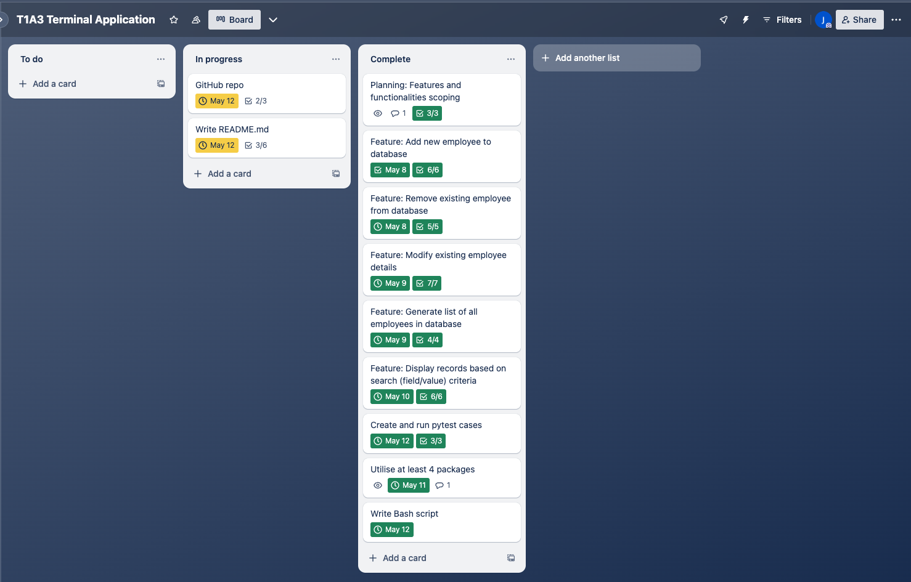
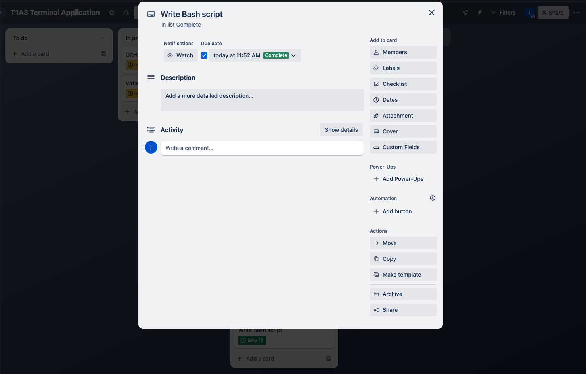
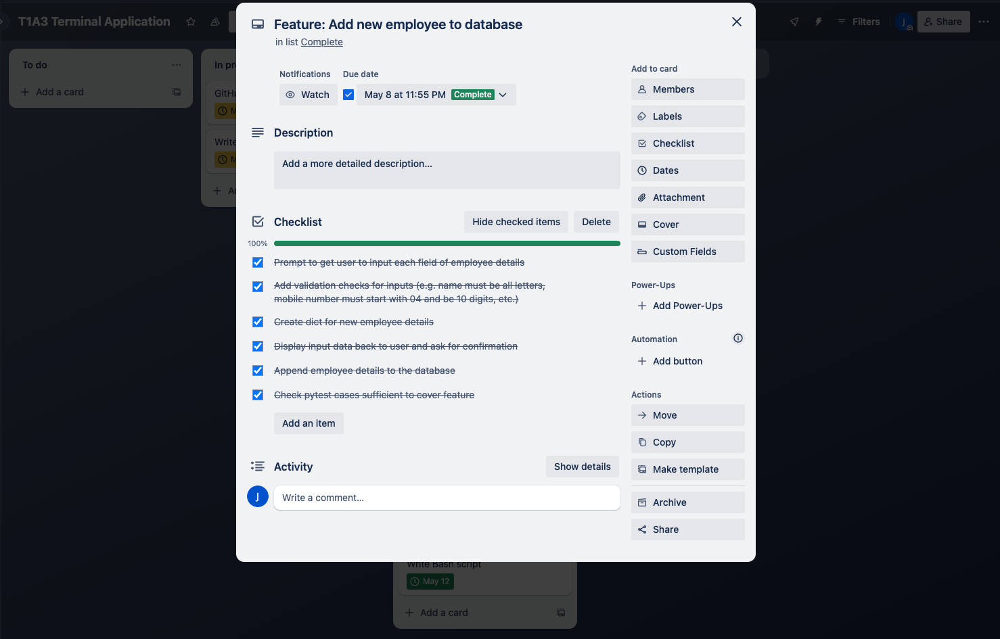
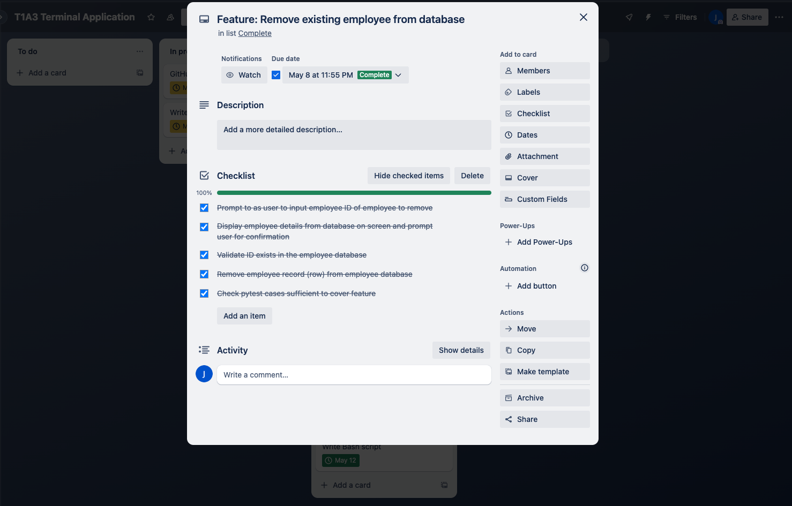
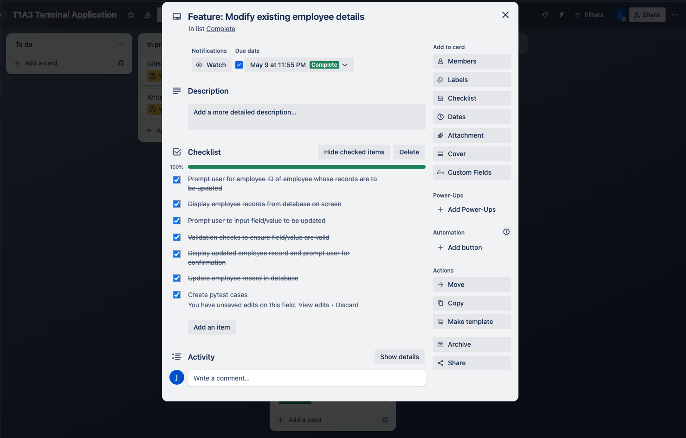
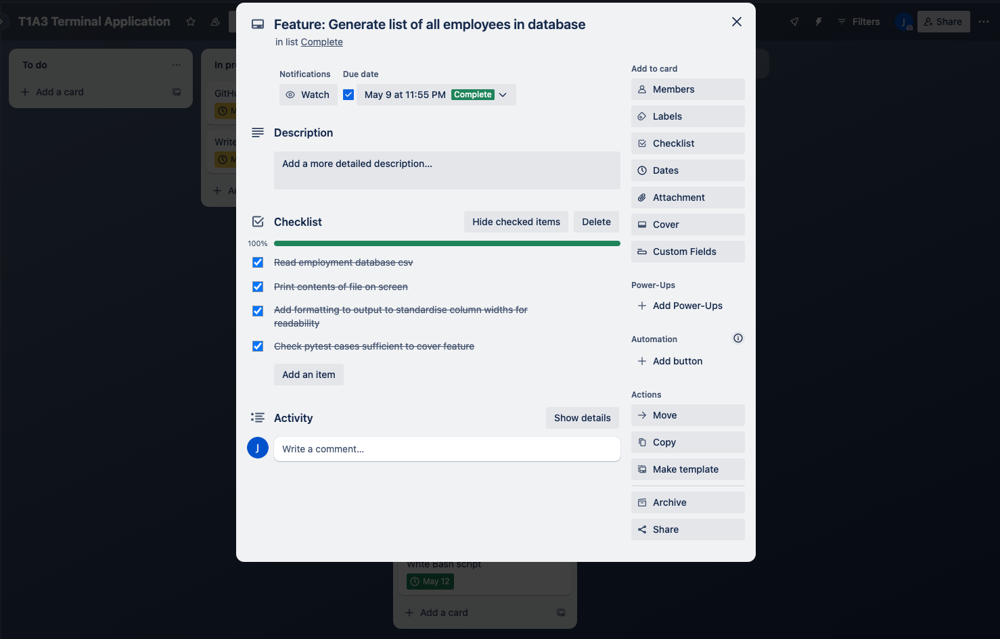
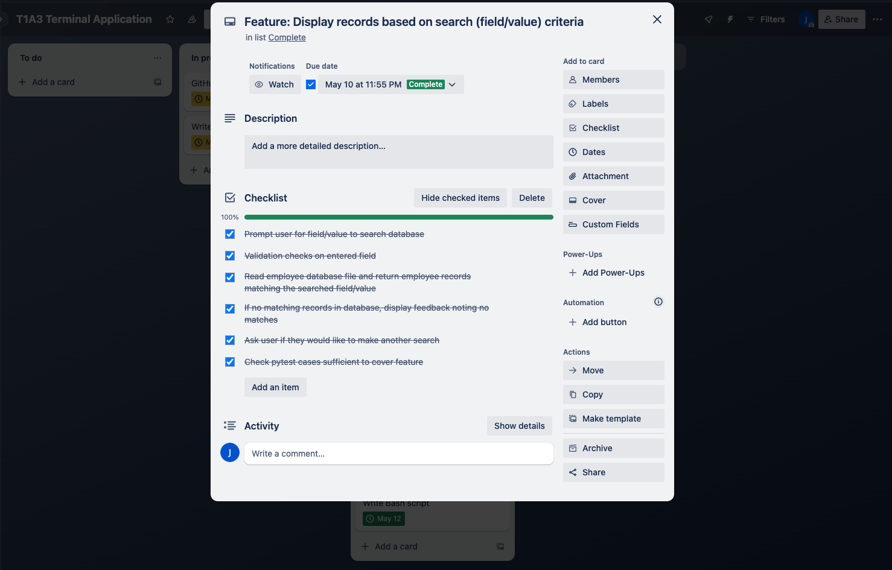
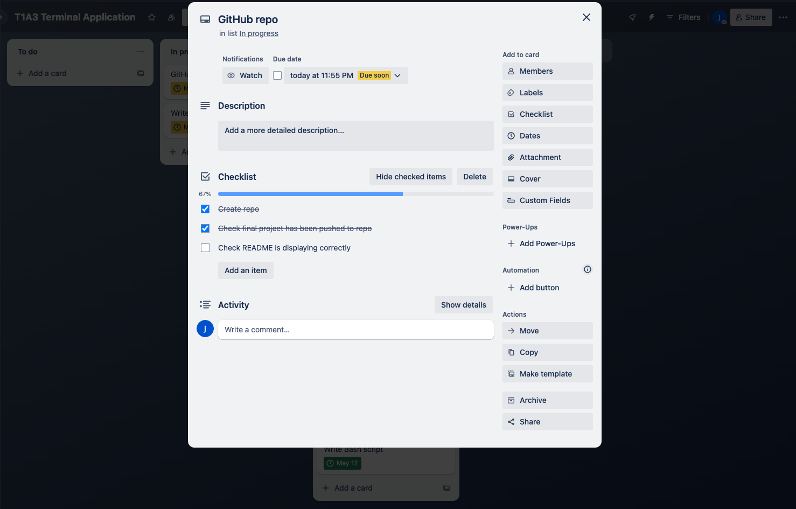
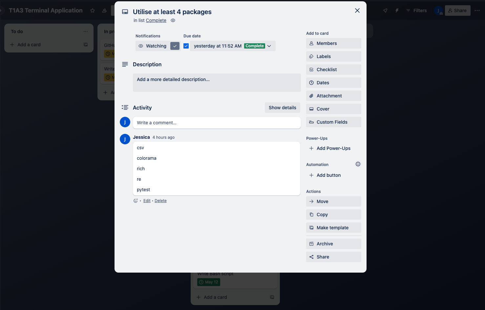
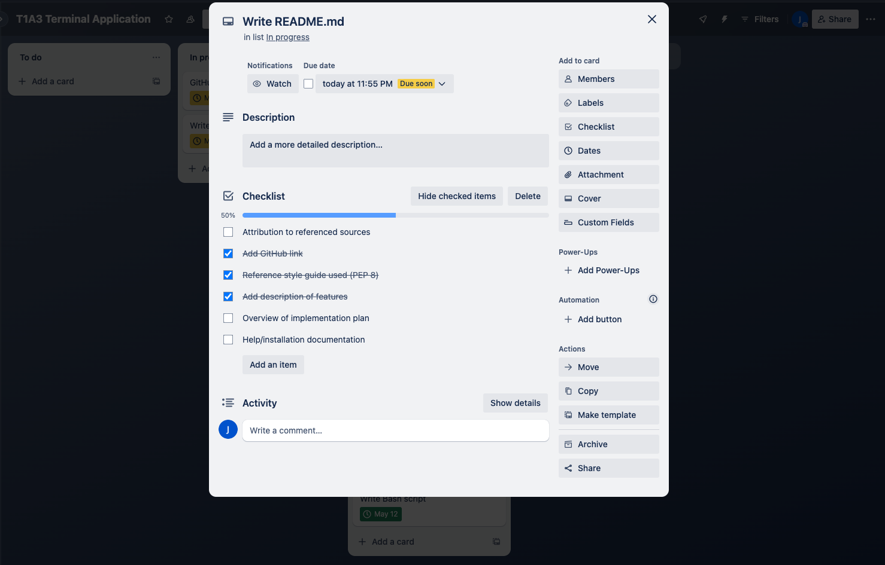
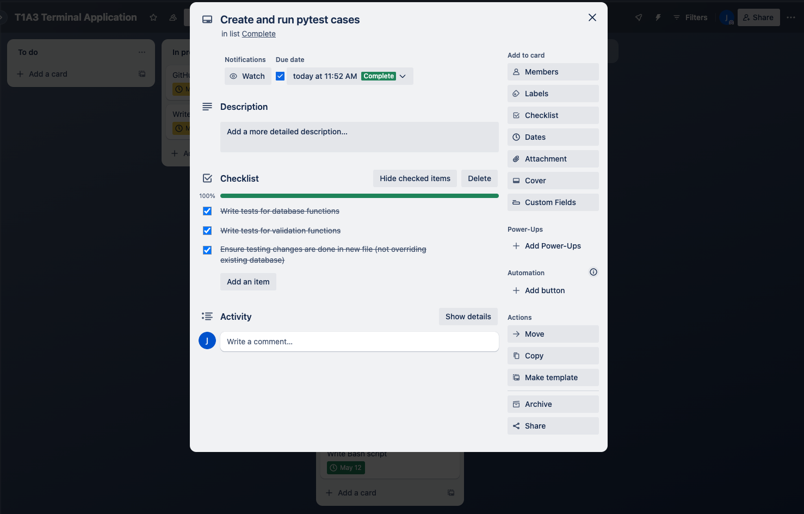

## System Requirements

Python version 3.7 or above is required to run this application.

To check what version of Python is installed on your system, use the following command:

```
python --version
```

To install or update to the latest version of Python, follow this [installation guide](https://wiki.python.org/moin/BeginnersGuide/Download).

## Installation

1. In the directory where the contents of this repo have been saved, navigate to the `src` folder.

2. Run the script by entering the following command:

```python
./run_employee_database.sh
```

Note: if an error message that says Python 3 is not installed is displayed, please install or upgrade Python by following the installation guide in the System Requirements section.

3. The script will create and activate a virtual environment and install the required dependencies (listed below).

## Dependencies

* colorama==0.4.6
* iniconfig==2.0.0
* markdown-it-py==3.0.0
* mdurl==0.1.2
* packaging==24.0
* pluggy==1.5.0
* Pygments==2.18.0
* pytest==8.2.0
* rich==13.7.1

## Packages and Modules
* csv
* colorama
* rich
* re
* pytest

## References

BeginnersGuide/Download (2022) BeginnersGuide/Download - Python Wiki. Available at: https://wiki.python.org/moin/BeginnersGuide/Download (Accessed: 12 May 2024).

Colorama (2022) PyPI. Available at: https://pypi.org/project/colorama/ (Accessed: 12 May 2024).

CSV - csv file reading and writing (2024) Python documentation. Available at: https://docs.python.org/3/library/csv.html (Accessed: 11 May 2024).

McGugan, W. (2024) Introduction¶, Introduction - Rich 13.6.0 documentation. Available at: https://rich.readthedocs.io/en/stable/introduction.html (Accessed: 12 May 2024).

PEP 8 – style guide for python code (2023) Python Enhancement Proposals (PEPs). Available at: https://peps.python.org/pep-0008/ (Accessed: 8 May 2024).

RE - regular expression operations (2024) Python documentation. Available at: https://docs.python.org/3/library/re.html (Accessed: 12 May 2024). 
